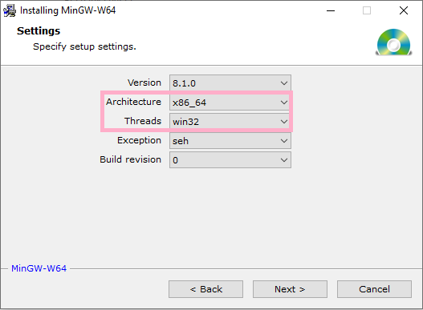
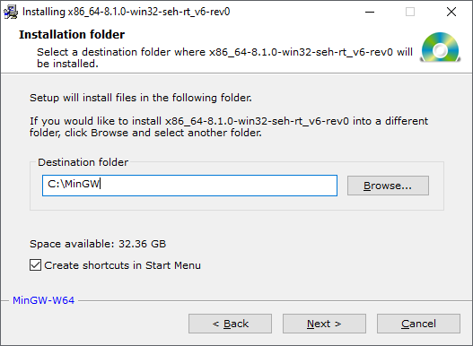
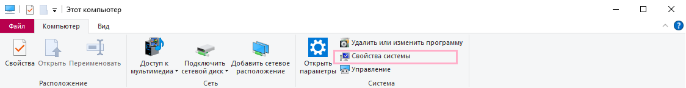
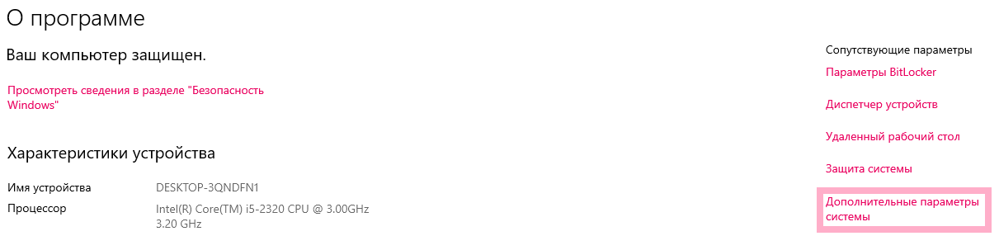
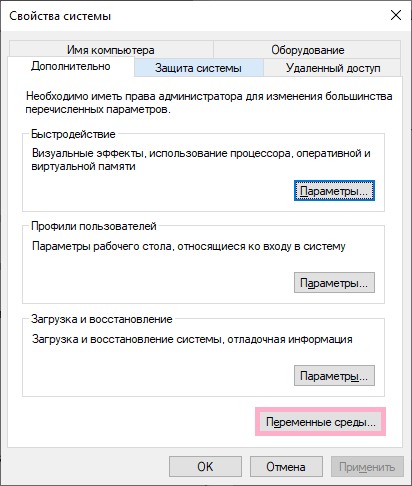
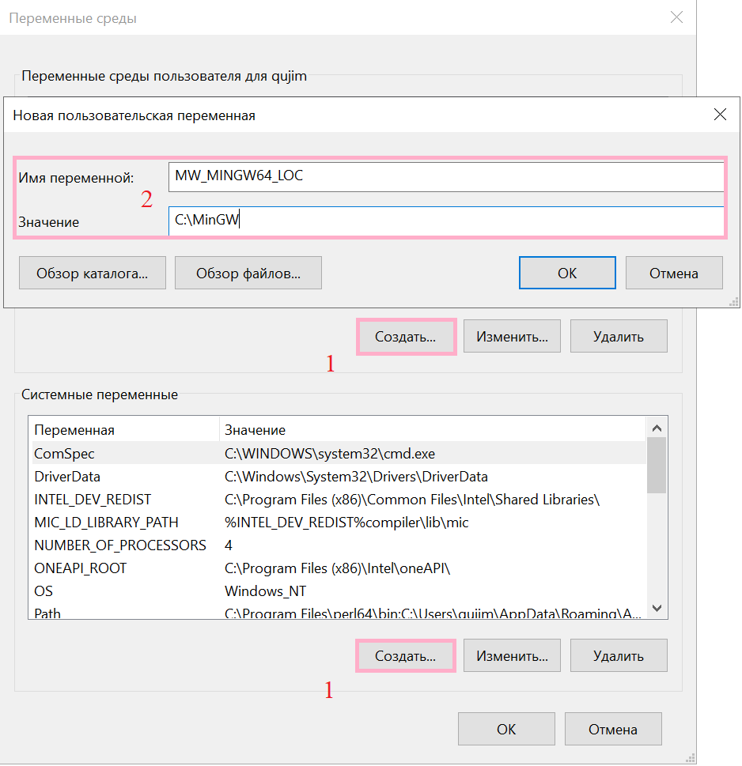

# mex Функции 

Matlab позволяет нативно компилировать `mex` функции средствами внешний компиляторов. В качестве таких компиляторов обычно выступает компилятор `Visual Studio` или компилятор [MinGW](https://en.wikipedia.org/wiki/MinGW).

- Чтобы использовать компилятор `Visual Studio`, необходимо, чтобы она была старше Matlab, т.к. иначе Matlab не будет знать о её существовании. Имеется ввиду, что Matlab 2017 года не увидит `Visual Studio 19` и т.д. Если это требование удовлетворенно, то можно сразу перескакивать к настройка Matlab;
- У `MinGW` не таких требований к совместимости, но часть работы необходимо проделать в ручную (смотри инструкцию ниже). 

Установить MinGW можно в самом Matlab в разделе `Home` > `Adds-on` > `get Add Ons` и вбив в поиске `MinGW`. Также скачать поддерживаемый компиллятор MinGW можно на [страничке](https://www.mathworks.com/matlabcentral/fileexchange/52848-matlab-support-for-mingw-w64-c-c-compiler?s_tid=mwa_osa_a) (нужна регистрация). Если аккаунта нет, то MinGW можно скачать бесплатно на множестве ресурсов. 

## Установка MinGW

Список ресурсов, где можно скачать `MinGW` можно найти [здесь](https://www.mingw-w64.org/downloads/#mingw-builds), автор выбрал [Mingw-builds](https://www.mingw-w64.org/downloads/#mingw-builds).

Скачав установщик, открываем и на странице с конфигурацией важно правильно подобрать архитектуру вашего компьютера и версию компилятора (см. таблицу). Вероятнее всего вам нужны `Architecture: x86_64` и `Threads: win_32`.

|MATLAB|MinGW|
|---|---|
|2015b --- 2017a|4.9.2|
|2017b-2018a|5.3.0|
|2018b---...|6.3.0|




Нажимаем `next` и выбираем путь для установки. Тут важно выбрать **не** содержащий пробелов путь, т.е. путь по умолчания в "C:\Program Files\mingw-w64\..." не подходит. Выберите, например, "C:\mingw-w64". У меня MinGW уже был установлен в папке "C:\MinGW". Запомните эту папку. Путь к ней пригодится на следующем шаге. 



Нажимаем и ждём пока установится. Теперь, чтобы matlab знал где искать компилятор, необходимо добавить путь к папке с установленным MinGW в переменные среды. 

`Этот компьютер` > `Свойства системы` > `Дополнительные параметры системы` > `Переменные среды` > `Создать` и в поле имя переменной вводим `MW_MINGW64_LOC`, а в поле `значение` вводим путь к папке с установленным MinGW. Жмём `Ок` несколько раз и на этом установка `MinGW` завершена.

1. 
2. 
3. 
4. 


## Настройка Matlab

Если у вас 
- стоят совместимые версии Matlab и Visual Studio с компилятором `C++`;
- установлен и настроен `MinGW`;
то дальше настройка осуществляется в MatLab командой
```{code}
mex -setup C++
```

После чего в зависимости от выбранного компилятора вы должны увидеть одно из двух следующих сообщений:
> MEX configured to use 'Microsoft Visual C++ 2019' for C++ language compilation.

или

> MEX configured to use 'MinGW64 Compiler (C++)' for C++ language compilation.
